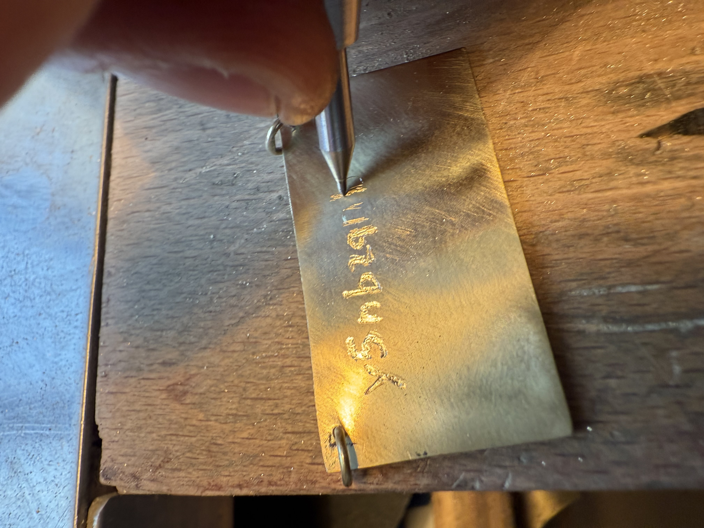
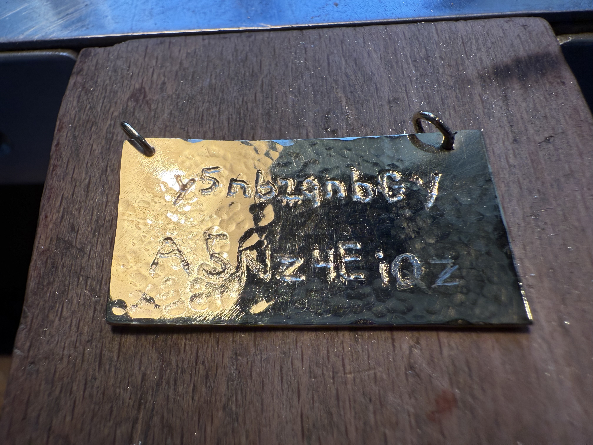

# Nonce

**An ephemeral identity viewer and a critical exploration of machine-generated identity tokens**

By Maayan Magenheim

## Concept & Intent
Modern authentication collapses a human presence into a transient ID Token (JWT) – a bodiless, contextless string. This project invites direct encounter with that abstraction, reframing the token as both a functional credential and an existential artifact.

## Why “Nonce”
In cryptography: a number used once - uniqueness, non-replay.  
In English echo: nonsense - machine language without human semantics.  
Nonce bridges utility and perceived meaninglessness, exposing the tension between protocol and person.

## Core Experience
1. User signs in with Google (client‑side only).
2. The issued ID Token is revealed, decoded, and hashed.
3. A shortened fingerprint (truncated SHA‑256) emphasizes a disposable representation.
4. (Extended concept) Token hash can be transformed into a physical engraving – slow, manual, permanent – resisting the ephemerality of digital identity.

## Physical Artifact (Extended Scope)
The live token (or its hash) is hand‑engraved, final characters partially erased to symbolize:
- Impermanence of machine identity
- Incompleteness of data as representation
- Reclamation of authorship over generated identifiers

### Process
Engraving of token/hash characters into brass; deliberate partial omission toward the end to emphasize ephemerality.



### Finished Piece
Final pendant and handoff moments.


## Critical Context
- Surveillance Capitalism (Shoshana Zuboff): identity operationalized for prediction/control.
- Data Subject vs Human Subject (Wendy Hui Kyong Chun): the token as a computational shadow.
Nonce surfaces the moment of conversion from lived self to a functional data token.

## Technical Features
- Google Identity Services (no backend)
- Raw JWT display (header/payload only; no signature validation)
- Base64URL payload decode
- SHA‑256 fingerprint + truncation
- Separation of concerns (HTML / CSS / pure logic / UI orchestration)

## File Structure
```
index.html     # Markup & script/style loading
styles.css     # Visual design and layout
logic.js       # Pure functions (NonceLogic)
ui.js          # DOM wiring, event handling, state transitions
A_2D_digital_graphic_of_a_JWT_(JSON_Web_Token)_ico.png  # Favicon
README.md      # Documentation
```

## Runtime Flow
1. Google button click => ID Token (JWT) returned to `handleCredentialResponse`.
2. Token cached; UI transitions from intro to inspection.
3. User actions: view full token, decode payload, derive shortened fingerprint, copy output.

## Core Logic (logic.js)
- `decodeJwt(token)` – Parse payload (no signature verification).
- `sha256Hex(text)` – Full SHA‑256 digest.
- `shortenToken(token, length=12)` – Truncated fingerprint.

## UI Layer (ui.js)
Handles element binding, state transitions, token reveal, decode + hash invocation via `NonceLogic`.

## Security / Trust Notes
- No signature (JWS) verification performed.
- Token is processed locally; never transmitted beyond Google issuance.
- Fingerprint is derived data; treat as sensitive.
- Educational visualization only; not an auth subsystem.

## Conceptual Questions
- Is identity here property or merely permission?
- What persists when authentication artifacts evaporate?
- Can material translation (engraving) reassert continuity against protocol ephemerality?

## Browser Requirements
Modern browser supporting `crypto.subtle` & `TextEncoder`.

## Extended Documentation
Detailed conceptual essay + appendices (application flow, process photos, finished piece):
https://docs.google.com/document/d/1-oTy6PPiaTa8eRL6Upe_1iTQBZVMOcJU-Hhxnb9-EhI/edit?usp=sharing

## Credits
Concept, design, and development by Maayan Magenheim.
Final photos by [Daniel Dahan](https://danieldahan.net). Engraving process documented July 27, 2025 (studio of Eldar Yinon). 
Developed within the Bezalel M.Des Industrial Design — Design & Technology application assignment.

## Disclaimer
Educational and reflective. Not suitable for production identity, security, or privacy use.

## License & Attribution
This project is available for artistic and educational use. If you build upon this work, please provide clear credit to the original author.
Commercial use is not permitted without prior written permission.
All rights not expressly granted are reserved by the author.